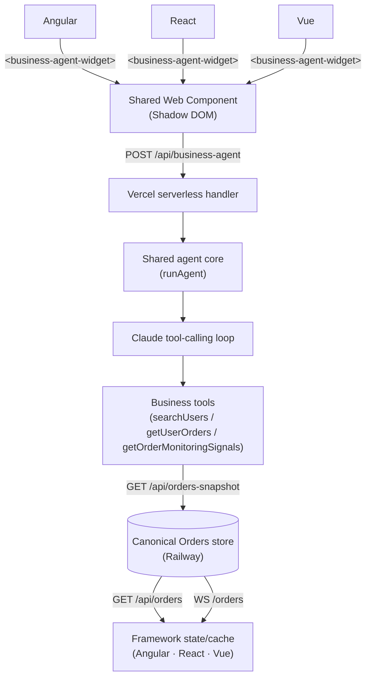

# LLM-Powered Business Agent — Deep Dive

[← Back to README](../README.md)

A Claude-powered business assistant that answers natural-language questions
about live Users/Orders data — "which users need attention right now,"
"how much has X spent" — using structured tool calling against the same
canonical backend state the UI reads, not a separate/stale copy of it.

## What it is

- Server-side Claude API integration with structured tool/function calling
  — a hand-rolled multi-step agent loop (`model → tool → result → model`),
  the same shape as this repo's development-facing `tools/agent.mjs`
- 3 read-only business tools (`searchUsers`, `getUserOrders`,
  `getOrderMonitoringSignals`) — thin wrappers over existing
  `@portal/users/utils` logic, no reimplemented domain logic
- Bounded multi-turn conversational history — the widget keeps a visible,
  bounded transcript and resends it each request, so the agent can resolve
  follow-ups ("what was his highest order?") without re-stating the subject
- One framework-independent `<business-agent-widget>` Web Component, shared
  verbatim by Angular, React, and Vue — no per-framework AI implementation

## Architecture

Both the UI and the Business Agent ultimately depend on the same canonical
Orders state — that's the core design constraint this feature is built
around.

## Agent loop

1. The widget sends the user's prompt plus the bounded conversation history
2. Claude decides whether it needs a tool to answer, and if so which one
3. Tools execute against the **current** canonical Orders snapshot — not a
   dataset frozen at process start
4. Tool results return to Claude, which may call further tools before
   answering
5. Claude produces a final business-oriented answer; the widget renders it
   and appends it to the visible transcript

Conversation history gives the agent *context* (what "his" refers to in a
follow-up); it never substitutes for fresh data — each request takes a
fresh canonical Orders snapshot at its start, and every tool call within
that request's loop reads that same snapshot, so an answer isn't drawn from
a fixed dataset from days ago just because the conversation is several
turns old.

## Source-of-truth model

The UI's initial load, the WebSocket stream, and the Business Agent's tools
all read from **one** canonical Railway store, which minimizes — though
doesn't perfectly eliminate — drift between them: the UI updates
continuously via WebSocket deltas, while the agent takes one fresh snapshot
per request, so a WS event that lands mid-conversation won't retroactively
appear in an answer already given. In practice that means handling the same
REST/WS race everywhere: an order can arrive over WebSocket before a page's
initial HTTP fetch resolves (buffered, then merged once the fetch
completes), or the HTTP snapshot can already include an order a WS event is
also about to
announce (deduped by id, not double-inserted). All three frameworks
upsert-by-id rather than blindly appending.

## Cross-framework integration

- One shared, framework-free `<business-agent-widget>` (Shadow DOM,
  configurable `endpoint` attribute, typed public `CustomEvent` contract)
  — built once, not reimplemented per framework
- Angular/React/Vue host adapters stay thin: register the element, render
  it, optionally react to its typed events — none contain agent
  orchestration or business logic, which stays server-side only
- Encapsulated styling and DOM via Shadow DOM — the widget can't leak
  styles into (or be broken by) whichever host app it's dropped into

## Deployment & security

- `ANTHROPIC_API_KEY` is server-side only — never reaches the browser
  (verified by a dedicated test asserting it's absent from every
  widget/host adapter/app source file)
- Real Vercel serverless endpoint (`/api/business-agent`), reusing the
  existing `runAgent`/tool logic as-is
- Request/Content-Type validation, bounded request body size, sanitized
  provider/server errors (Anthropic failures logged server-side, safe
  messages only returned to the browser), bounded SDK retries
- Vercel Firewall rate limiting (8 requests/60s per IP), verified live
  against the deployed Preview
- The public response includes a `trace` of which tools were called and with
  what input (e.g. `{ name: 'getUserOrders', input: { userId: 3 } }`) —
  intentional demo/developer observability that shows genuine tool calling
  happened, not an oversight. It carries only tool names and business-domain
  input arguments (values already implied by the user's own prompt) — never
  raw provider text, the system prompt, or another user's unrelated data.
  The widget itself doesn't render it to end users; host apps log it to the
  dev console only (see each host adapter's `onAnswer` handler).
- Preview-scoped backend configuration rather than hardcoded/wildcard
  values: React and Vue read `VITE_ORDERS_API_URL`/`VITE_ORDERS_WS_URL`;
  Angular's Preview build generates its own `environment.preview.ts`
  (gitignored) from the same Preview-scoped variables at build time, so no
  ephemeral Preview hostname is ever committed
- The Hybrid MFE's Angular Preview build resolves its React remote URL the
  same way, so the Preview composition loads the matching React Preview
  build rather than production

## Preview MFE note

A protected cross-origin Vercel Preview deployment can intercept a Module
Federation remote's `remoteEntry.js` request before it's ever served — the
browser reports it as a CORS failure, but the actual response is Vercel
Deployment Protection redirecting to an SSO challenge. Worth knowing before
chasing CORS configuration on a Preview remote that never actually served
the file.

## Example interactions

Grounded in this repo's own mock data (`Noam Katz`, user id 3, orders
totaling $655.00 with a $510.10 high-value order — see
`tools/business-agent-core.spec.ts`).

**1. "How many orders does Noam have and what is his total?"**
Demonstrates `searchUsers` (resolve the name to a user id) → `getUserOrders`
(current orders + spend summary) against live data, not a fixed dataset.

**2. "What was his highest order?" (asked as a follow-up)**
Demonstrates multi-turn context — "his" resolves from the prior turn — and
reasoning over the already-fetched order list rather than a fresh tool call
restating the subject.

**3. "Are there any monitoring signals I should know about?"**
Demonstrates `getOrderMonitoringSignals` — the same high-value/burst rules
that drive the UI's own warning/critical toasts, surfaced conversationally.

## Demo-scale simplifications

Honest about what's intentionally simplified for a portfolio-scale demo,
not production infrastructure:

- The canonical Orders store is in-memory, process-local to the Railway
  service — not a persistent database. Restarting that process resets it.
  It retains the latest 30 orders per user (count-based, not TTL) so a
  long-lived process doesn't grow every reader's payload — including the
  Business Agent's own tool-result token usage — unboundedly.
- Demo orders are synthetically generated by the server process itself (one
  generator per process, independent of how many clients are connected) to
  keep the store populated for the live deploys.
- No authentication/session layer — see [docs/roadmap.md](./roadmap.md)
  for the planned (not yet implemented) auth work.

These are acceptable trade-offs for this project's goals and aren't
"solved" with production infrastructure (a real database, Redis, etc.)
here — see the roadmap for what's actually planned next.
